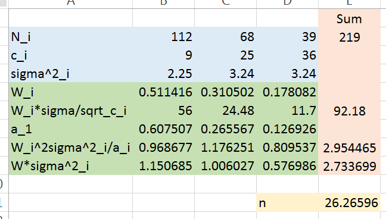
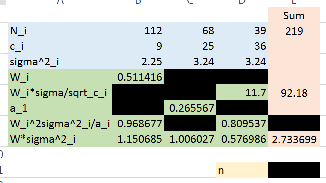

\newcommand{\E}[1]{E{\left(#1\right)}}
\newcommand{\flist}[2]{\{#1_1, #1_2, \ldots, #1_#2\}}
\newcommand{\fulist}[3]{\{#1_{{#2}1}, #1_{{#2}2}, \ldots, #1_{{#2}{#3}}\}}
\renewcommand{\bar}[1]{\overline{#1}}
\newcommand{\SE}[1]{\sqrt{\hat{V}(#1)}}

# test 2 information

## Midterm details

The second test is on March 24. TA office hours will probably be the same as last time (and will be announced on the course website.)

The test will begin at 3:30 and will be designed to be 1 hour in length, but you     
will have until 5:00 to complete it if you wish.

The specific topics covered will be:

* SRS for proportions and counts
* Stratified random sampling
* Required reading topics added 2016-03-16 (required reading discussion on Monday)

## Stratified example question

These sorts of questions are tedious, time consuming, and error prone, when done entirely by hand. So I'll probably try something like this.

Here's my spreadsheet solution to question 5.1 (a sample size question):



## Stratified example question

On a test I might produce a similar table but with some of the calculated entries obscured, like this (ALTHOUGH THE W_i ROW IS WRONG):



(Note: CORRECTED spreadsheet available in this lecture's github: `stratified.xlsx`)

# back to ratio, regression, difference estimation

## recap { .build }

If one has a sample $\{(y_1,x_1),\ldots,(y_n,x_n)\}$ the following may be of interest:

1. To estimate the population ratio $R = \tau_y\big/\tau_x$ using $\hat R=r=\bar y\big/\bar x$.

2. To enable estimation of $\tau_y$ when $N$ is unknown.

3. To enable improved estimation of $\tau_y$ or $\mu_y$ when $y$ and $x$ are correlated.

Formula summary:

$r$ | $\hat\tau_y$ | $\hat\mu_y$ | $\hat V(r)$
----|--------------|-------------|------------
$\bar y\big/\bar x$ | $r\tau_x$ | $r\mu_x$ | $s^2_r(1-n/N)$

The error bounds are based on this new object:
$$s^2_r = \frac{\sum_{i=1}^n (y_i - r x_i )^2}{n-1}$$

## $r_i = y_i - r x_i$ is a "residual"

```{r, echo=FALSE, message=FALSE}
library(rio)
library(dplyr)
library(knitr)
salary <- import("Ch 6 Exercises.xlsx", sheet="6.10")
N_teacher <- 750
r <- sum(salary$Present)/sum(salary$Past)

```

Reconsider the teacher salary example with $r = `r r`$. First 5 lines shown:

```{r, echo=FALSE, message=FALSE, warning=FALSE}
salary %>% 
  mutate("Predicted = r*Past" = r*Past, r_i = Present - r*Past) %>% 
  slice(1:5)
```

Think of $rx_i$ as the "predicted" value for $y_i$. Then $y_i - rx_i$ is in some sense a prediction error, or "residual". And $s^2_r$ is just the "average" of the squared residuals.

## "residuals" plotted

```{r, echo=FALSE, fig.width=8, fig.height=5, fig.align='center'}
library(ggplot2)
salary %>% 
  ggplot(aes(x=Past, y=Present)) + 
  geom_point(size=2) + 
  geom_abline(slope=r, intercept = 0) + 
  geom_segment(aes(x=Past, y=Present, xend = Past, yend=r*Past), color="red", size=1)
```

## from $\tau_y$ to $\mu_y$

It was possible to estimate $\tau_y$ without knowing $N$ (or $\tau_x$). If they are known then it is possible to estimate $\mu_y$ using ratio techniques more accurately than with SRS observing $y_i$ alone.

Last time we had explicit formulae for $\hat\tau_y$ and $\hat V(\hat\tau_y)$. They are easily adjusted to get:

$$\begin{align}
\hat\mu_y &= \frac{\sum_{i=1}^n y_i}{\sum_{i=1}^n x_i}\mu_x = \frac{\hat\tau_y}{N}\\
\hat V(\hat\mu_y) &= \left(1-\frac{n}{N}\right)\frac{s^2_r}{n}
\end{align}$$

## such an example of improved estimation { .build }

We have estimated a ratio and estimated $\tau_y$ using ratio techniques because there was no other option. In this example we'll estimate $\mu_y$ using ratio techniques simply to take advantage of the information contained in the $x$ variable.

```{r, echo=FALSE}
rats <- import("Ch 6 Exercises.xlsx", sheet="6.6")
N_rats <- 763
n_rats <- nrow(rats)
mu_x <- 17.2
```

Consider question 6.6. "Rats doing mazes while on drugs". They have $N = `r N_rats`$ who completed the maze on the standard drug in an average of $\mu_x=`r mu_x`$ seconds. 

A random sample of 11 rats are given a new drug. Their old times $x_i$ were known from before and they complete the maze while on the new drug in time $y_i$. 

The task is to estimate the average maze time $\mu_y$ for the new drug. 

## these are your rats on drugs

```{r, echo=FALSE, fig.align='center', fig.width=5, fig.height=3}
r_rats <- mean(rats$New)/mean(rats$Standard)
rats %>% 
  ggplot(aes(x=Standard, y=New)) + geom_point() + 
  ylim(13, 20)+ 
  geom_abline(slope = r_rats, intercept=0)
rats %>% 
  select(-Rat) %>% 
  mutate(r_i = New - r_rats*Standard) -> rats_aug
s2r <- var(rats_aug$r_i)
mu_y_hat = r_rats*mu_x
v_hat <- (1-n_rats/N_rats)*s2r/n_rats
```

The estimated ratio is $r = `r r_rats`$. The mean estimate using the ratio technique is: 
$$\hat\mu_y = r\mu_x = `r r_rats` \cdot `r mu_x` = `r mu_y_hat`$$


## bounding the estimation error { .build }

It turns out $s^2_r = `r s2r`$. So the estimated variance of $\hat\mu_y$ is:

$$\hat V(\hat\mu_y) = \left(1-\frac{`r n_rats`}{`r N_rats`}\right)\frac{`r s2r`}{`r n_rats`} = `r v_hat`$$

So the usual bound on the error of estimation would be $B=2\sqrt{\hat V(\hat\mu_y)} = `r 2*sqrt(v_hat)`$.

Equivalently a 95% confidence interval for $\mu_y$ is $`r mu_y_hat` \pm `r 2*sqrt(v_hat)`$.

## how much better than SRS on $y_i$ alone? { .build }

It would be perfectly correct to ignore the $x_i$ and $\mu_x$ that are given and simply estimate $\mu_y$ with $\bar y$ using regular SRS theory.

```{r, echo=FALSE}
v_hat_y <- var(rats$New)/n_rats*(1-n_rats/N_rats)
```


If we did that, we would get $\bar y = `r mean(rats$New)`$. The error bound would depend now on the old:
$$s^2_y = \frac{\sum_{i=1}^n (y_i - \bar y)^2}{n-1} = `r var(rats$New)`$$
and the SRS bound on the error of estimation would be based on::
$$\hat V(\bar y) = \left(1-\frac{n}{N}\right)\frac{s^2_y}{n} = `r v_hat_y`$$
giving us a $B_{SRS}$ of $`r 2*sqrt(v_hat_y)`$...substantially higher than $`r 
2*sqrt(v_hat)`$.

## so, when does the ratio technique improve $\hat{\mu}_y$? { .build }

The math is complicated (see p. 177 and 6.8 for the gory details).

In practice it tends to work well in repeated surveys where the numbers are being updated, i.e. the $y_i$ are new versions of the $x_i$.

These is a more technical summary of when an improvement is likely:

* when the relationship between $y$ and $x$ is linear (not curved) and "through the origin" ($y$'s are directly proportional to the $x$'s). 

* when the correlation coefficient between the $y_i$ and $x_i$ is high enough, say $\hat\rho > 0.5$. 

## evaluating the rats data

```{r, echo=FALSE, fig.align='center', fig.height=3, fig.width=3}
rats %>% 
  ggplot(aes(x=Standard, y=New)) + geom_point() + 
  ylim(13, 20) + 
  geom_abline(slope = r_rats, intercept=0)
```

Linear and "through the origin".

Also:
$$\hat\rho = `r cor(rats$New, rats$Standard)`$$
So the big improvement over SRS is not surprising. 

## sample size requirements for ratio techniques { .build }

Nothing more than a slight adjustment to the regular SRS formula. 

In fact the sample size requirement to estimate the mean $\mu_y$ using ratio techniques to within a bound $B$ (with 95% confidence) is unchanged at:
$$n = \frac{N\sigma^2}{(N-1)\frac{B^2}{4} + \sigma^2}$$


To estimate a ratio $R$ to within $B_R$ simply note that $\hat V(r) = \frac{1}{\mu_x^2}\hat V(\hat\mu_y)$, so just use $B = B_R\mu_x$ in the above formula.

IMPORTANT: note that here $\sigma^2$ is now the population variance of the ratios $y_i/x_i$, so...

## possibly improved formula??

$$n = \frac{N\sigma_R^2}{(N-1)\frac{B^2}{4} + \sigma_R^2}$$

As usual $\sigma^2_R$ is unknown, so some prior information ought to be used - such as $s^2_r$ from either a prior survey or a pilot sample. (The old range/4 guess is probably a bad idea this time---why?)

## sample size for ratio example { .build }

Suppose with the rats we wanted to estimate the ratio $R$ with a bound $B$ of 0.01. We can use $s^2_r = `r s2r`$ as a guess for $\sigma^2_R$. The sample size required is:

$$n = \frac{`r N_rats`\cdot`r s2r`}{(`r N_rats-1`)\frac{`r (0.01*mu_x)^2`}{4} + `r s2r`} = 
`r N_rats*s2r/((N_rats - 1)*(0.01*mu_x)^2/4 + s2r)`$$